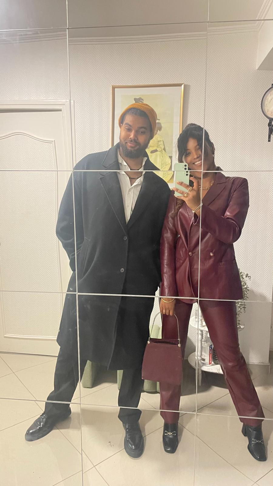
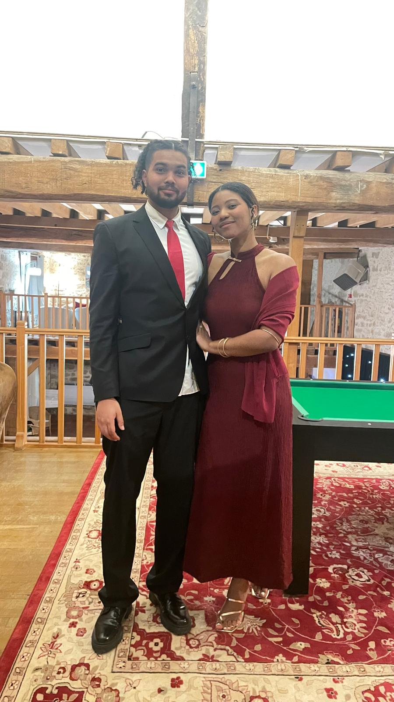
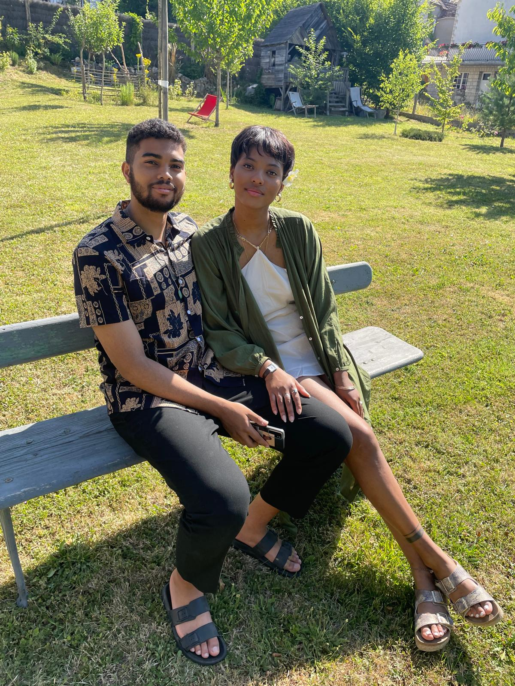
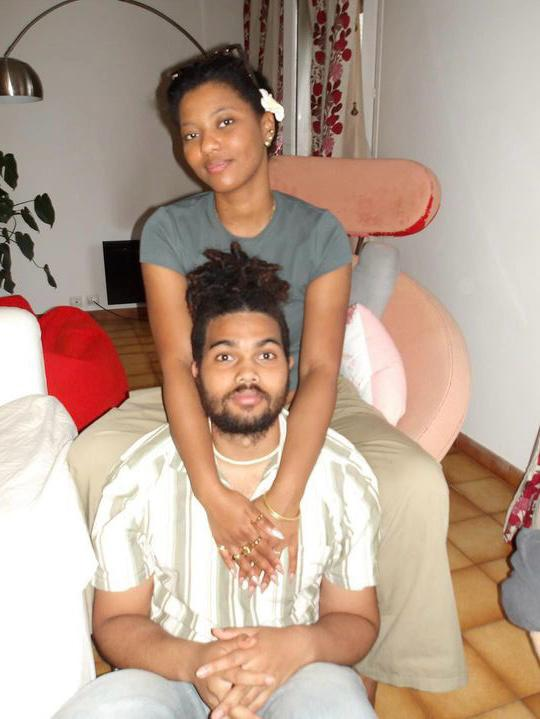
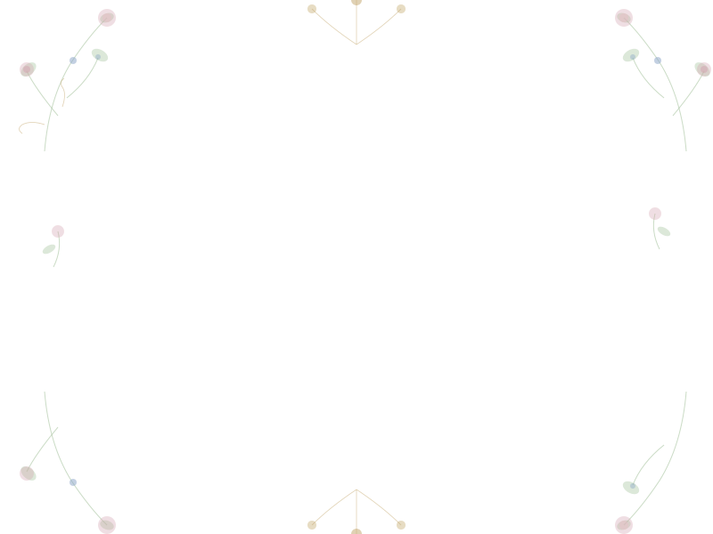

- Page 1 — Une enveloppe animée au centre. Au clic, elle s'ouvre, une lettre apparaît avec le texte qui se "tape" comme progressivement Penelope écrivant (avec une police manuscrite, voix-off Bridgerton). En scrollant, on glisse naturellement vers le contenu de la page 2.

- Page 2 — Révèle en scroll : date, lieu, RSVP, galerie, programme — tout dans le style Bridgerton (couleurs pastel bleu ciel / vert sauge / or, polices serif élégantes, ornements floraux SVG).



## `./static/img/bridgerton_wedding_mockup.html`

```html

<style>
@import url('https://fonts.googleapis.com/css2?family=Playfair+Display:ital,wght@0,400;0,700;1,400&family=Cormorant+Garamond:ital,wght@0,300;0,400;1,300;1,400&family=Dancing+Script:wght@400;700&display=swap');

*{box-sizing:border-box;margin:0;padding:0}
.preview{font-family:'Cormorant Garamond',serif;background:linear-gradient(135deg,#f5f0e8,#e8f0f5);border-radius:12px;padding:2rem;min-height:520px;display:flex;flex-direction:column;gap:2rem}
.badge{display:inline-block;background:rgba(180,160,120,0.2);border:1px solid rgba(180,160,120,0.6);color:#7a6040;font-size:11px;letter-spacing:2px;text-transform:uppercase;padding:4px 12px;border-radius:20px;margin-bottom:8px}
.section{background:rgba(255,255,255,0.7);border:0.5px solid rgba(180,160,120,0.4);border-radius:12px;padding:1.5rem;display:flex;flex-direction:column;gap:12px}
.sec-title{font-family:'Playfair Display',serif;font-size:13px;font-weight:700;color:#6b5030;letter-spacing:1px;text-transform:uppercase}
.envelope-demo{display:flex;flex-direction:column;align-items:center;gap:12px}
.env{width:120px;height:80px;background:#f0e8d5;border:1.5px solid #c4a76a;border-radius:4px;position:relative;cursor:pointer;transition:transform 0.3s}
.env:hover{transform:scale(1.05)}
.env-flap{position:absolute;top:0;left:0;width:100%;height:40px;background:#e8dcc8;border-bottom:1px solid #c4a76a;clip-path:polygon(0 0,50% 60%,100% 0);transition:transform 0.4s}
.env.open .env-flap{transform:rotateX(160deg);transform-origin:top}
.env-label{font-family:'Dancing Script',cursive;font-size:12px;color:#7a6040;padding-top:44px;text-align:center}
.letter-demo{width:100px;height:70px;background:#fffdf7;border:1px solid #ddd8c8;border-radius:2px;display:flex;align-items:center;justify-content:center;font-family:'Dancing Script',cursive;font-size:9px;color:#6b5030;text-align:center;padding:6px;line-height:1.4}
.pages-flow{display:flex;gap:8px;align-items:flex-start}
.page-card{flex:1;background:rgba(255,255,255,0.8);border:0.5px solid rgba(180,160,120,0.5);border-radius:8px;padding:12px;min-height:120px}
.page-num{font-family:'Playfair Display',serif;font-size:10px;color:#c4a76a;letter-spacing:2px;margin-bottom:6px}
.page-content{display:flex;flex-direction:column;gap:4px}
.block{height:8px;border-radius:2px;background:rgba(180,160,120,0.25)}
.block.dark{background:rgba(100,70,30,0.3)}
.block.w60{width:60%}
.block.w80{width:80%}
.block.w40{width:40%}
.arrow-down{text-align:center;color:#c4a76a;font-size:18px;padding:4px}
.color-row{display:flex;gap:6px;flex-wrap:wrap}
.swatch{width:40px;height:24px;border-radius:4px;display:flex;align-items:center;justify-content:center;font-size:8px;color:white;font-weight:600}
.files-list{display:flex;flex-direction:column;gap:6px}
.file-item{display:flex;align-items:center;gap:8px;font-size:12px;color:#6b5030}
.file-icon{width:24px;height:24px;background:rgba(180,160,120,0.2);border:1px solid rgba(180,160,120,0.4);border-radius:4px;display:flex;align-items:center;justify-content:center;font-size:10px;color:#7a6040;font-weight:700}
</style>
<div class="preview">
<h2 class="sr-only">Maquette du site de mariage Bridgerton</h2>

<div style="text-align:center">
  <div class="badge">Phylidia & Guillaume — Mariage</div>
  <div style="font-family:'Playfair Display',serif;font-size:22px;color:#4a3520;margin-top:6px;font-style:italic">Structure du site proposée</div>
</div>

<div style="display:grid;grid-template-columns:1fr 1fr;gap:1rem">

  <div class="section">
    <div class="sec-title">📜 Page 1 — L'enveloppe</div>
    <div class="envelope-demo">
      <div class="env open" id="envDemo">
        <div class="env-flap"></div>
        <div class="env-label">P & G</div>
      </div>
      <div style="font-size:11px;color:#7a6040;text-align:center">↑ clic → s'ouvre<br>la lettre monte</div>
      <div class="letter-demo">"Chère lectrice,<br>il se trouve que<br>notre histoire<br>commence ici..."</div>
      <div style="font-size:10px;color:#9a8060;text-align:center;font-style:italic">texte tapé lettre par lettre<br>effet machine à écrire élégant</div>
    </div>
  </div>

  <div class="section">
    <div class="sec-title">🌸 Page 2 — Contenu</div>
    <div class="pages-flow">
      <div style="display:flex;flex-direction:column;gap:6px;width:100%">
        <div style="font-size:10px;color:#7a6040;font-style:italic">scroll vers le bas ↓</div>
        <div class="page-card">
          <div class="page-num">① Date & Lieu</div>
          <div class="page-content">
            <div class="block dark w60"></div>
            <div class="block w80"></div>
            <div class="block w40"></div>
          </div>
        </div>
        <div class="page-card">
          <div class="page-num">② Programme</div>
          <div class="page-content">
            <div class="block w80"></div>
            <div class="block w60"></div>
            <div class="block w80"></div>
          </div>
        </div>
        <div class="page-card">
          <div class="page-num">③ RSVP + Photos</div>
          <div class="page-content">
            <div class="block dark w40"></div>
            <div class="block w80"></div>
          </div>
        </div>
      </div>
    </div>
  </div>

</div>

<div class="section">
  <div class="sec-title">🎨 Palette Bridgerton</div>
  <div class="color-row">
    <div class="swatch" style="background:#8ba5c9">Bleu<br>ciel</div>
    <div class="swatch" style="background:#a8c5a0">Vert<br>sauge</div>
    <div class="swatch" style="background:#c4a76a">Or</div>
    <div class="swatch" style="background:#d4a5b0">Rose<br>poudré</div>
    <div class="swatch" style="background:#7a6040">Brun<br>encre</div>
    <div class="swatch" style="background:#f5f0e8;color:#7a6040;border:1px solid #c4a76a">Crème<br>parchemin</div>
  </div>
  <div style="font-size:11px;color:#7a6040;font-style:italic">Typographies : Playfair Display (titres) + Dancing Script (lettres manuscrites) + Cormorant Garamond (texte)</div>
</div>

<div class="section">
  <div class="sec-title">📁 Fichiers générés</div>
  <div class="files-list">
    <div class="file-item"><div class="file-icon">H</div><strong>index.html</strong> — page principale (enveloppe + lettre + scroll vers page 2)</div>
    <div class="file-item"><div class="file-icon">C</div><strong>style.css</strong> — tout le style Bridgerton</div>
    <div class="file-item"><div class="file-icon">J</div><strong>main.js</strong> — animations enveloppe, effet typewriter, scroll reveal</div>
    <div class="file-item"><div class="file-icon">S</div><strong>flowers.svg</strong> — ornements floraux (inline, pas d'image externe)</div>
  </div>
  <div style="font-size:11px;color:#7a6040;margin-top:4px;font-style:italic">→ Tu ajoutes tes images/vidéos dans un dossier <code>assets/</code> sur GitHub</div>
</div>

</div>
<script>
const env = document.getElementById('envDemo');
env.addEventListener('click', () => env.classList.toggle('open'));
</script>

```

Ce que fait chaque fichier :

`index.html`— La page entière : enveloppe + lettre + les 6 sections du mariage. Cherche `✏️ PERSONNALISE`pour trouver rapidement ce à quoi tu dois toucher (date, lieu, horaires, citation…).

`style.css` — Tout le style Bridgerton : palette crème/ou/bleu-sauge/rose, typographies Playfair Display + Dancing Script + Cormorant Garamond, animations scroll dévoilent.

`main.js` — Les comportements : l'enveloppe s'ouvre au clic, le cachet de cire disparaît, la lettre monte, le texte se bande lettre par lettre avec des pauses naturelles sur les virgules et les points (comme Penelope), puis la signature apparaît, puis la flèche de scroll. Cliquer sur la lettre pendant la frappe permet de sauter directement à la fin.

`flowers.svg` — Les ornements floraux SVG (tiges, feuilles, fleurs, vrilles) pour le fond de la page enveloppe.

Pour mettre en ligne sur GitHub :

1. Crée un repo, mets tous les fichiers à la racine
2. Crée un dossier `assets/` et glisse tes photos dedans (nommées `photo1.jpg`, `gallery1.jpg`, etc.)
3. Pages GitHub actives dans Paramètres → Pages
4. Pour les RSVP par email : crée un compte Formspree (gratuit, 50 réponses/mois)

Le README détaille tout ça étape par étape. Félicitations à vous deux ! 💍

## `README.md'
```md
# 💍 Phylidia & Guillaume — Site de Mariage

Site de mariage au style **Bridgerton** — enveloppe animée, lettre manuscrite, scroll reveal élégant.

## Structure des fichiers

```
/
├── index.html       ← Page principale
├── style.css        ← Tout le style Bridgerton
├── main.js          ← Animations (enveloppe, typewriter, countdown, galerie)
├── flowers.svg      ← Ornements floraux SVG
├── assets/          ← TES PHOTOS ET VIDÉOS ICI
│   ├── photo1.jpg
│   ├── photo2.jpg
│   ├── photo3.jpg
│   ├── gallery1.jpg
│   ├── gallery2.jpg
│   ├── gallery3.jpg
│   ├── gallery4.jpg
│   ├── gallery5.jpg
│   └── video-couple.mp4  (optionnel)
└── README.md
```

## Déploiement sur GitHub Pages

1. Crée un repo GitHub (ex: `BibiUnion2` ou `mariage-phylidia-guillaume`)
2. Uploade tous les fichiers à la racine
3. Va dans **Settings → Pages → Source → main → / (root)**
4. Ton site sera disponible sur `https://TONNOM.github.io/NOM-DU-REPO/`

## Personnalisation

Cherche `✏️ PERSONNALISE` dans `index.html` pour trouver tous les endroits à modifier :

| Ce qu'il faut changer | Où |
|---|---|
| Vraie date de mariage | `data-date="2025-09-20T15:00:00"` dans le countdown |
| Date limite RSVP | Texte dans la section RSVP |
| Lieu & adresse | Section "Le Lieu" |
| Horaires du programme | Section "Le Déroulé du Jour" |
| Infos hébergement | Section "Hébergement" |
| Citation personnelle | Section "De nos Cœurs aux Vôtres" |
| Texte de la lettre | Variable `LETTER_TEXT` dans `main.js` |

## Ajouter tes photos

Place tes photos dans le dossier `assets/` :

```
assets/photo1.jpg    → Photo principale 1 (page d'accueil)
assets/photo2.jpg    → Photo principale 2
assets/photo3.jpg    → Photo principale 3
assets/gallery1.jpg  → Galerie photo 1
... etc
```

**Pour une vidéo** dans la galerie, décommente ce bloc dans `index.html` :
```html
<video src="assets/video-couple.mp4" autoplay muted loop playsinline></video>
```

## Formulaire RSVP avec Formspree (gratuit)

1. Crée un compte sur [formspree.io](https://formspree.io)
2. Crée un nouveau formulaire → récupère ton ID (ex: `xrgpkqdo`)
3. Dans `index.html`, modifie le `<form>` :
```html
<form class="rsvp-form" id="rsvp-form" 
      action="https://formspree.io/f/xrgpkqdo" 
      method="POST">
```
4. Dans `main.js`, remplace la simulation par un vrai fetch :
```javascript
const res = await fetch(form.action, {
  method: 'POST',
  body: new FormData(form),
  headers: { 'Accept': 'application/json' }
});
```

Tu recevras les RSVP directement par email !

## Palette de couleurs (Bridgerton)

| Couleur | Variable CSS | Usage |
|---|---|---|
| Crème parchemin | `--cream` | Fond principal |
| Or | `--gold` | Accents, bordures |
| Bleu ciel sauge | `--blue-sage` | Dégradés |
| Vert sauge | `--green-sage` | Ornements, feuilles |
| Rose poudré | `--rose` | Fleurs, pétales |
| Brun encre | `--ink` | Texte principal |

## Polices utilisées (Google Fonts)

- **Playfair Display** — Titres élégants
- **Cormorant Garamond** — Corps du texte raffiné  
- **Dancing Script** — Lettre manuscrite, signature

---

*Fait avec ♡ — Bon mariage à vous deux !*


## `ìndex.html`

```html
<!doctype html>
<html lang="fr">
  <head>
    <meta charset="UTF-8" />
    <meta name="viewport" content="width=device-width, initial-scale=1.0" />
    <title>Phylidia & Guillaume — Notre Mariage 💍</title>

    <!-- Favicon -->
    <link
      rel="icon"
      type="image/png"
      href="https://raw.githubusercontent.com/THEMEZE/BibiUnion2/main/static/img/Bridgerton_logo_square.png"
    />

    <!-- Open Graph -->
    <meta property="og:title" content="Phylidia & Guillaume — Notre Mariage" />
    <meta
      property="og:description"
      content="Nous avons l'honneur de vous inviter à partager notre jour le plus précieux. 💍"
    />
    <meta
      property="og:image"
      content="https://raw.githubusercontent.com/THEMEZE/BibiUnion2/main/static/img/Bridgerton_logo_square.png"
    />
    <meta property="og:type" content="website" />
    <meta property="og:url" content="https://themeze.github.io/BibiUnion2/" />

    <!-- Twitter Card -->
    <meta name="twitter:card" content="summary_large_image" />
    <meta name="twitter:title" content="Phylidia & Guillaume — Notre Mariage" />
    <meta
      name="twitter:description"
      content="Nous avons l'honneur de vous inviter à partager notre jour le plus précieux. 💍"
    />
    <meta
      name="twitter:image"
      content="https://raw.githubusercontent.com/THEMEZE/BibiUnion2/main/static/img/Bridgerton_logo_square.png"
    />

    <!-- Fonts & styles -->
    <link rel="stylesheet" href="style.css" />
  </head>

  <body>
    <!-- ════════════════════════════════════════════════════
  PAGE 1 — ENVELOPPE
════════════════════════════════════════════════════ -->
    <section id="page-envelope" aria-label="Invitation — cliquez pour ouvrir">
      <!-- Ornement SVG en arrière-plan -->
      <!-- (flowers.svg est référencé via CSS background-image) -->

      <header class="envelope-header">
        <p class="pre-title">Vous êtes cordialement invités au mariage de</p>
        <h1>
          <em>Phylidia</em><br />
          &amp;<br />
          <em>Guillaume</em>
        </h1>
        <div class="ornament-divider">✦</div>
        <p
          style="
            font-family: var(--font-body);
            font-style: italic;
            color: var(--ink-muted);
            font-size: 1rem;
            letter-spacing: 2px;
          "
        >
          Cliquez sur l'enveloppe pour découvrir votre invitation
        </p>
      </header>

      <!-- ENVELOPPE -->
      <div class="envelope-wrapper">
        <div
          class="envelope"
          id="envelope"
          role="button"
          tabindex="0"
          aria-label="Ouvrir l'enveloppe pour lire votre invitation"
          onkeydown="
            if (event.key === 'Enter' || event.key === ' ') this.click();
          "
        >
          <!-- Corps -->
          <div class="env-body"></div>
          <!-- Triangles latéraux (ombre intérieure) -->
          <div class="env-side-left"></div>
          <div class="env-side-right"></div>
          <!-- Triangle du bas -->
          <div class="env-bottom"></div>
          <!-- Rabat supérieur -->
          <div class="env-flap"></div>
          <!-- Cachet de cire -->
          <div class="env-seal">P&amp;G</div>
        </div>

        <!-- LETTRE (sort de l'enveloppe) -->
        <article class="letter" id="letter" aria-live="polite">
          <div class="letter-header">
            <span class="letter-monogram">Phylidia &amp; Guillaume</span>
            <span class="letter-date">10/07/2026</span>
          </div>
          <!-- Texte tapé lettre par lettre -->
          <p
            class="letter-body"
            id="letter-body"
            aria-label="Texte de l'invitation"
          ></p>
          <!-- Signature -->
          <p class="letter-signature" id="letter-signature">
            Phylidia &amp; Guillaume ♡
          </p>
        </article>
      </div>
      <!-- /envelope-wrapper -->

      <!-- Hint de scroll après la lettre -->
      <div class="scroll-hint" id="scroll-hint">
        <p>Faites défiler pour découvrir</p>
        <button
          class="scroll-arrow"
          id="scroll-down-btn"
          aria-label="Faire défiler vers le bas"
        >
          ↓
        </button>
      </div>
    </section>

    <!-- ════════════════════════════════════════════════════
  PAGE 2 — CONTENU DU MARIAGE
════════════════════════════════════════════════════ -->
    <div id="page-content">
      <!-- ── ① HERO ──────────────────────────────────────── -->
      <section id="section-hero" class="w-section" aria-labelledby="hero-title">
        <!-- Ornement SVG floral (inline, couleur or) -->
        <svg
          aria-hidden="true"
          focusable="false"
          width="120"
          height="60"
          viewBox="0 0 120 60"
          style="display: block; margin: 0 auto 1.5rem; opacity: 0.5"
        >
          <path
            d="M60,30 Q40,10 10,15"
            stroke="#c4a76a"
            stroke-width="1"
            fill="none"
          />
          <path
            d="M60,30 Q80,10 110,15"
            stroke="#c4a76a"
            stroke-width="1"
            fill="none"
          />
          <path
            d="M60,30 Q60,5 60,0"
            stroke="#c4a76a"
            stroke-width="0.8"
            fill="none"
          />
          <circle cx="10" cy="15" r="4" fill="#c4a76a" opacity="0.7" />
          <circle cx="110" cy="15" r="4" fill="#c4a76a" opacity="0.7" />
          <circle cx="60" cy="0" r="5" fill="#c4a76a" opacity="0.8" />
          <ellipse
            cx="30"
            cy="20"
            rx="9"
            ry="5"
            fill="#a8c5a0"
            opacity="0.5"
            transform="rotate(-25,30,20)"
          />
          <ellipse
            cx="90"
            cy="20"
            rx="9"
            ry="5"
            fill="#a8c5a0"
            opacity="0.5"
            transform="rotate(25,90,20)"
          />
        </svg>

        <div class="reveal">
          <p class="names" id="hero-title">
            Phylidia<br />
            <span class="ampersand">&amp;</span>
            Guillaume
          </p>
        </div>

        <div class="reveal reveal-delay-2">
          <!-- 
        ✏️ PERSONNALISE : remplace par ta vraie date et lieu
      -->
          <p class="hero-date">Mercredi 15 Juillet 2026</p>
          <p class="hero-location">Paris, France</p>
        </div>

        <!-- COMPTE À REBOURS -->
        <!-- ✏️ PERSONNALISE : change data-date avec ta vraie date de mariage -->
        <div class="reveal reveal-delay-3" style="margin-top: 2rem">
          <div
            id="countdown"
            data-date="2026-07-15T14:00:00"
            style="
              display: flex;
              justify-content: center;
              gap: 2rem;
              flex-wrap: wrap;
              font-family: var(--font-display);
              color: var(--ink-light);
            "
          >
            <!-- Rempli par JS -->
          </div>
          <style>
            #countdown span {
              display: flex;
              flex-direction: column;
              align-items: center;
              gap: 0.25rem;
              font-size: 2rem;
              font-weight: 400;
              font-style: italic;
              color: var(--ink);
            }
            #countdown small {
              font-family: var(--font-body);
              font-style: normal;
              font-size: 0.7rem;
              letter-spacing: 2px;
              text-transform: uppercase;
              color: var(--ink-muted);
            }
          </style>
        </div>

        <!-- Photos principales (à remplacer par tes vraies images) -->
        <div class="reveal reveal-delay-4">
          <div class="media-strip" style="margin-top: 3rem">
            <!-- 
          ✏️ PERSONNALISE : remplace src par tes vraies photos
          Pour ajouter une vidéo : utilise <video> au lieu de 
          Exemple :
          <video src="assets/video.mp4" autoplay muted loop playsinline></video>
        -->

            <div class="media-item" data-src="assets/photo1.jpg">
              <svg viewBox=\'0 0 24 24\' fill=\'none\' stroke=\'currentColor\' stroke-width=\'1\'><rect x=\'3\' y=\'3\' width=\'18\' height=\'18\' rx=\'2\'/><circle cx=\'8.5\' cy=\'8.5\' r=\'1.5\'/><path d=\'m21 15-5-5L5 21\'/></svg><span>Photo 1</span></div>'
                "
              />
            </div>

            <div class="media-item" data-src="assets/photo2.jpg">
              <svg viewBox=\'0 0 24 24\' fill=\'none\' stroke=\'currentColor\' stroke-width=\'1\'><rect x=\'3\' y=\'3\' width=\'18\' height=\'18\' rx=\'2\'/><circle cx=\'8.5\' cy=\'8.5\' r=\'1.5\'/><path d=\'m21 15-5-5L5 21\'/></svg><span>Photo 2</span></div>'
                "
              />
            </div>

            <div class="media-item" data-src="assets/photo3.jpg">
              <svg viewBox=\'0 0 24 24\' fill=\'none\' stroke=\'currentColor\' stroke-width=\'1\'><rect x=\'3\' y=\'3\' width=\'18\' height=\'18\' rx=\'2\'/><circle cx=\'8.5\' cy=\'8.5\' r=\'1.5\'/><path d=\'m21 15-5-5L5 21\'/></svg><span>Photo 3</span></div>'
                "
              />
            </div>
          </div>
        </div>
      </section>

      <!-- ── ② PROGRAMME ─────────────────────────────────── -->
      <section
        id="section-programme"
        class="w-section"
        aria-labelledby="prog-title"
      >
        <!-- Ornement -->
        <svg
          aria-hidden="true"
          width="60"
          height="30"
          viewBox="0 0 60 30"
          style="display: block; margin: 0 auto 0.75rem; opacity: 0.4"
        >
          <path
            d="M30,15 Q20,5 5,8 M30,15 Q40,5 55,8 M30,15 Q30,3 30,0"
            stroke="#c4a76a"
            stroke-width="1"
            fill="none"
          />
        </svg>

        <span class="section-label reveal">Le Programme</span>
        <h2 class="section-title reveal" id="prog-title">Le Déroulé du Jour</h2>

        <div id="programme-timeline" class="timeline">
          <!-- 
        ✏️ PERSONNALISE : modifie les horaires, titres et descriptions
      -->

          <div class="timeline-item reveal reveal-delay-1">
            <div class="timeline-time">14h00</div>
            <div style="position: relative">
              <div class="timeline-dot"></div>
              <div class="timeline-content">
                <h3>Cérémonie Civile</h3>
                <p>Mairie du 19e arrondissement, Paris</p>
              </div>
            </div>
          </div>

          <div class="timeline-item reveal reveal-delay-2">
            <div class="timeline-time">15h00</div>
            <div style="position: relative">
              <div class="timeline-dot"></div>
              <div class="timeline-content">
                <h3>Vin d'honneur</h3>
                <p>Parc du Buttes-Chaumont</p>
              </div>
            </div>
          </div>

          <div class="timeline-item reveal reveal-delay-3">
            <div class="timeline-time">17h00</div>
            <div style="position: relative">
              <div class="timeline-dot"></div>
              <div class="timeline-content">
                <h3>Dîner de Gala</h3>
                <p>????</p>
              </div>
            </div>
          </div>

          <!-- <div class="timeline-item reveal reveal-delay-4">
        <div class="timeline-time">22h30</div>
        <div style="position:relative">
          <div class="timeline-dot"></div>
          <div class="timeline-content">
            <h3>Bal & Fête</h3>
            <p>Danse, célébration jusqu'à l'aube</p>
          </div>
        </div>
      </div> -->
        </div>
        <!-- /timeline -->
      </section>

      <!-- ── ③ INFOS PRATIQUES ────────────────────────────── -->
      <section
        id="section-details"
        class="w-section"
        aria-labelledby="details-title"
      >
        <span class="section-label reveal">Informations</span>
        <h2 class="section-title reveal" id="details-title">
          Ce qu'il faut savoir
        </h2>

        <div class="cards">
          <div class="detail-card reveal reveal-delay-1">
            <span class="card-icon">🏛️</span>
            <h3>Le Lieu</h3>
            <!-- ✏️ PERSONNALISE -->
            <p>
              Mairie du 19ᵉ arrondissement <br />
              75019 Paris<br />
              <a
                href="https://maps.google.com/?q=Mairie+du+19ᵉ+arrondissement+de+Paris"
                target="_blank"
                rel="noopener"
              >
                Voir sur la carte →
              </a>
            </p>
          </div>

          <div class="detail-card reveal reveal-delay-2">
            <span class="card-icon">🚗</span>
            <h3>Comment venir</h3>
            <!-- ✏️ PERSONNALISE -->
            <p>
              Gare du Nord -> Laumière <br />
              (5 min) • Métro 5 • Bobigny - Pablo Picasso
            </p>
          </div>

          <!-- <div class="detail-card reveal reveal-delay-3">
            <span class="card-icon">🏨</span> -->
          <!-- <h3>Hébergement</h3> -->
          <!-- ✏️ PERSONNALISE -->
          <!-- <p>
              Des chambres sont réservées à l'<br />
              Hôtel Aigle Noir ★★★★<br />
              <a href="https://www.hotelaigle.fr" target="_blank" rel="noopener"
                >Réserver →</a
              >
            </p>
          </div> -->

          <div class="detail-card reveal reveal-delay-4">
            <span class="card-icon">👗</span>
            <h3>Code vestimentaire</h3>
            <!-- ✏️ PERSONNALISE -->
            <p>
              Tenue de soirée élégante.<br />
              Palette : tons jaune &amp; blanc.<br />
              <!-- Le blanc est réservé à la mariée. -->
            </p>
          </div>
        </div>
        <!-- /cards -->
      </section>

      <!-- ── ④ GALERIE ────────────────────────────────────── -->
      <section
        id="section-gallery"
        class="w-section"
        aria-labelledby="gallery-title"
      >
        <span class="section-label reveal">Notre Histoire</span>
        <h2 class="section-title reveal" id="gallery-title">En Images</h2>

        <!--
      ✏️ PERSONNALISE : 
      • Remplace les src par tes vraies photos/vidéos
      • Ajoute data-src="chemin/vers/image.jpg" sur .gallery-item pour le lightbox
      • Pour une vidéo : <video src="..." autoplay muted loop playsinline></video>
      • Organise tes fichiers dans assets/ sur GitHub
    -->
        <div class="gallery-grid reveal">
          <div class="gallery-item" data-src="assets/gallery1.jpg">
            📷<span>Photo 1</span></div>'
              "
            />
          </div>

          <div class="gallery-item" data-src="assets/gallery2.jpg">
            📷<span>Photo 2</span></div>'
              "
            />
          </div>

          <div class="gallery-item" data-src="assets/gallery3.jpg">
            📷<span>Photo 3</span></div>'
              "
            />
          </div>

          <div class="gallery-item" data-src="assets/gallery4.jpg">
            📷<span>Photo 4</span></div>'
              "
            />
          </div>

          <div class="gallery-item" data-src="assets/gallery5.jpg">
            📷<span>Photo 5</span></div>'
              "
            />
          </div>

          <div class="gallery-item">
            <!-- Exemple avec vidéo : décommente et adapte -->
            <!--
        <video src="assets/video-couple.mp4" autoplay muted loop playsinline></video>
        -->
            <div class="gallery-placeholder">
              <svg
                viewBox="0 0 24 24"
                width="32"
                height="32"
                fill="none"
                stroke="currentColor"
                stroke-width="1"
              >
                <polygon points="5 3 19 12 5 21 5 3" />
              </svg>
              <span>Vidéo à venir</span>
            </div>
          </div>
        </div>
        <!-- /gallery-grid -->
      </section>

      <!-- ── ⑤ RSVP ───────────────────────────────────────── -->
      <section id="section-rsvp" class="w-section" aria-labelledby="rsvp-title">
        <span class="section-label reveal">Répondez</span>
        <h2 class="section-title reveal" id="rsvp-title">
          Confirmer votre présence
        </h2>

        <p
          class="reveal"
          style="
            text-align: center;
            font-style: italic;
            color: var(--ink-muted);
            margin-bottom: 2.5rem;
            font-size: 1.05rem;
            max-width: 480px;
            margin-left: auto;
            margin-right: auto;
          "
        >
          Merci de bien vouloir confirmer votre venue avant le
          <!-- ✏️ PERSONNALISE -->
          <strong style="color: var(--gold-dark)">1er juillet 2025</strong>.
        </p>

        <!--
      ✏️ PERSONNALISE : 
      Pour recevoir les RSVP par email, utilise Formspree :
      1. Crée un compte sur formspree.io
      2. Crée un nouveau formulaire
      3. Remplace action="" par action="https://formspree.io/f/TON_ID"
      4. Ajoute method="POST"
    -->
        <form class="rsvp-form reveal" id="rsvp-form" novalidate>
          <div class="form-row">
            <div class="form-group">
              <label for="rsvp-prenom">Prénom</label>
              <input
                type="text"
                id="rsvp-prenom"
                name="prenom"
                required
                placeholder="Votre prénom"
              />
            </div>
            <div class="form-group">
              <label for="rsvp-nom">Nom</label>
              <input
                type="text"
                id="rsvp-nom"
                name="nom"
                required
                placeholder="Votre nom"
              />
            </div>
          </div>

          <div class="form-group">
            <label for="rsvp-email">Adresse email</label>
            <input
              type="email"
              id="rsvp-email"
              name="email"
              required
              placeholder="vous@exemple.fr"
            />
          </div>

          <div class="form-row">
            <div class="form-group">
              <label for="rsvp-presence">Présence</label>
              <select id="rsvp-presence" name="presence" required>
                <option value="" disabled selected>Choisir…</option>
                <option value="oui">Oui, avec grand plaisir ! ♡</option>
                <option value="non">Je serai malheureusement absent(e)</option>
              </select>
            </div>
            <div class="form-group">
              <label for="rsvp-convives">Nombre de convives</label>
              <select id="rsvp-convives" name="convives">
                <option value="1">1 personne</option>
                <option value="2">2 personnes</option>
                <option value="3">3 personnes</option>
                <option value="4">4 personnes</option>
              </select>
            </div>
          </div>

          <div class="form-group">
            <label for="rsvp-regime">Régime alimentaire</label>
            <select id="rsvp-regime" name="regime">
              <option value="aucun">Aucune restriction</option>
              <option value="vegetarien">Végétarien</option>
              <option value="vegan">Vegan</option>
              <option value="sans-gluten">Sans gluten</option>
              <option value="halal">Halal</option>
              <option value="autre">Autre (préciser ci-dessous)</option>
            </select>
          </div>

          <div class="form-group">
            <label for="rsvp-message">Un message, un souhait ?</label>
            <textarea
              id="rsvp-message"
              name="message"
              placeholder="Un mot gentil pour les mariés, une restriction alimentaire à préciser…"
            ></textarea>
          </div>

          <button type="submit" class="btn-primary">
            Envoyer ma réponse →
          </button>
        </form>
        <!-- /rsvp-form -->

        <!-- Message de confirmation -->
        <div class="rsvp-success" id="rsvp-success" aria-live="polite">
          Merci infiniment ! Votre réponse a bien été reçue. ♡<br />
          <span
            style="
              font-size: 0.9rem;
              color: var(--ink-muted);
              font-family: var(--font-body);
              font-style: italic;
            "
          >
            Nous avons hâte de vous accueillir en ce jour si précieux.
          </span>
        </div>
      </section>

      <!-- ── ⑥ MOT DES MARIÉS ─────────────────────────────── -->
      <section
        id="section-mot"
        class="w-section"
        aria-labelledby="mot-title"
        style="text-align: center"
      >
        <!-- Ornement SVG bas de page -->
        <svg
          aria-hidden="true"
          width="200"
          height="80"
          viewBox="0 0 200 80"
          style="display: block; margin: 0 auto 2rem; opacity: 0.35"
        >
          <path
            d="M100,40 Q70,10 20,20 M100,40 Q130,10 180,20"
            stroke="#c4a76a"
            stroke-width="1.2"
            fill="none"
          />
          <path
            d="M100,40 Q80,20 50,5 M100,40 Q120,20 150,5"
            stroke="#a8c5a0"
            stroke-width="0.8"
            fill="none"
          />
          <circle cx="20" cy="20" r="5" fill="#c4a76a" opacity="0.8" />
          <circle cx="180" cy="20" r="5" fill="#c4a76a" opacity="0.8" />
          <circle cx="50" cy="5" r="4" fill="#d4a5b0" opacity="0.7" />
          <circle cx="150" cy="5" r="4" fill="#d4a5b0" opacity="0.7" />
          <ellipse
            cx="70"
            cy="18"
            rx="10"
            ry="5"
            fill="#a8c5a0"
            opacity="0.4"
            transform="rotate(-20,70,18)"
          />
          <ellipse
            cx="130"
            cy="18"
            rx="10"
            ry="5"
            fill="#a8c5a0"
            opacity="0.4"
            transform="rotate(20,130,18)"
          />
        </svg>

        <span class="section-label reveal">Un mot</span>
        <h2 class="section-title reveal" id="mot-title">
          De nos Cœurs aux Vôtres
        </h2>

        <blockquote
          class="reveal"
          style="
            max-width: 600px;
            margin: 0 auto;
            font-family: var(--font-display);
            font-size: clamp(1.1rem, 2.5vw, 1.4rem);
            font-style: italic;
            color: var(--ink-light);
            line-height: 1.8;
            position: relative;
            padding: 0 2rem;
          "
        >
          <span
            style="
              position: absolute;
              left: 0;
              top: -0.5rem;
              font-size: 3rem;
              color: var(--gold);
              opacity: 0.4;
              line-height: 1;
              font-family: Georgia, serif;
            "
            >"</span
          >
          <!-- ✏️ PERSONNALISE : votre citation ou mot personnel -->
          Partager ce jour avec vous est notre plus grande joie. Vous qui avez
          accompagné notre histoire, chacun à votre façon, vous serez le plus
          beau cadeau de ce mariage.
          <span
            style="
              position: absolute;
              right: 0;
              bottom: -0.5rem;
              font-size: 3rem;
              color: var(--gold);
              opacity: 0.4;
              line-height: 1;
              font-family: Georgia, serif;
            "
            >"</span
          >
        </blockquote>

        <p
          class="reveal reveal-delay-2"
          style="
            margin-top: 2rem;
            font-family: var(--font-script);
            font-size: 1.5rem;
            color: var(--gold-dark);
          "
        >
          Phylidia &amp; Guillaume
        </p>
      </section>
    </div>
    <!-- /page-content -->

    <!-- ════════════════════════════════════════════════════
  FOOTER
════════════════════════════════════════════════════ -->
    <footer id="page-footer">
      <span class="footer-monogram">P &amp; G</span>

      <div
        class="ornament-divider"
        style="justify-content: center; max-width: 300px; margin: 0 auto 1rem"
      >
        ✦
      </div>

      <!-- ✏️ PERSONNALISE -->
      <p>20 Septembre 2025 — Paris, France</p>

      <p
        style="
          margin-top: 1rem;
          font-size: 0.8rem;
          color: var(--ink-muted);
          opacity: 0.6;
        "
      >
        Fait avec amour ♡
      </p>
    </footer>

    <!-- Script principal -->
    <script src="main.js"></script>
  </body>
</html>
```

## `style.css``

```css
@import url('https://fonts.googleapis.com/css2?family=Playfair+Display:ital,wght@0,400;0,600;0,700;1,400;1,600&family=Cormorant+Garamond:ital,wght@0,300;0,400;0,500;1,300;1,400;1,500&family=Dancing+Script:wght@400;500;600;700&display=swap');

/* ── RESET & BASE ─────────────────────────────────────── */
*,*::before,*::after{box-sizing:border-box;margin:0;padding:0}
html{scroll-behavior:smooth;font-size:16px}
body{
  font-family:'Cormorant Garamond',serif;
  background-color:#f7f2e8;
  color:#3a2c1a;
  overflow-x:hidden;
  line-height:1.7;
}

/* ── CSS VARIABLES ────────────────────────────────────── */
:root{
  --cream:#f7f2e8;
  --cream-dark:#ede4d0;
  --parchment:#f0e8d0;
  --gold:#c4a76a;
  --gold-dark:#a88a4a;
  --gold-light:#e8d5a0;
  --blue-sage:#8ba5c9;
  --green-sage:#a8c5a0;
  --rose:#d4a5b0;
  --ink:#3a2c1a;
  --ink-light:#7a6040;
  --ink-muted:#9a8060;
  --white-warm:#fffdf8;
  --font-display:'Playfair Display',serif;
  --font-body:'Cormorant Garamond',serif;
  --font-script:'Dancing Script',cursive;
  --transition:0.6s cubic-bezier(0.25,0.46,0.45,0.94);
}

/* ── UTILITIES ────────────────────────────────────────── */
.sr-only{position:absolute;width:1px;height:1px;overflow:hidden;clip:rect(0,0,0,0);white-space:nowrap}

/* ══════════════════════════════════════════════════════
   PAGE 1 — ENVELOPE HERO
══════════════════════════════════════════════════════ */
#page-envelope{
  min-height:100vh;
  display:flex;
  flex-direction:column;
  align-items:center;
  justify-content:center;
  background:radial-gradient(ellipse at 30% 40%, #dde8f0 0%, #f7f2e8 45%, #ede4d0 100%);
  position:relative;
  overflow:hidden;
  padding:2rem;
}

/* Floral SVG background ornaments */
#page-envelope::before{
  content:'';
  position:absolute;
  inset:0;
  background-image:url("flowers.svg");
  background-size:cover;
  opacity:0.12;
  pointer-events:none;
}

/* Top monogram / date */
.envelope-header{
  text-align:center;
  margin-bottom:3rem;
  opacity:0;
  transform:translateY(-20px);
  animation:fadeSlideDown 1s var(--transition) 0.3s forwards;
}
.envelope-header .pre-title{
  font-family:var(--font-script);
  font-size:1.1rem;
  color:var(--ink-muted);
  letter-spacing:2px;
  margin-bottom:0.5rem;
}
.envelope-header h1{
  font-family:var(--font-display);
  font-size:clamp(2.5rem,6vw,4.5rem);
  font-weight:400;
  font-style:italic;
  color:var(--ink);
  line-height:1.1;
}
.envelope-header h1 em{
  font-style:normal;
  color:var(--gold-dark);
}

/* Divider ornament */
.ornament-divider{
  display:flex;
  align-items:center;
  gap:1rem;
  color:var(--gold);
  font-size:1.2rem;
  margin:0.75rem 0;
  justify-content:center;
}
.ornament-divider::before,
.ornament-divider::after{
  content:'';
  flex:1;
  max-width:80px;
  height:1px;
  background:linear-gradient(90deg,transparent,var(--gold),transparent);
}

/* ── ENVELOPE ─────────────────────────────────────────── */
.envelope-wrapper{
  position:relative;
  display:flex;
  flex-direction:column;
  align-items:center;
  perspective:1200px;
}

.envelope{
  width:min(420px, 90vw);
  height:min(280px, 60vw);
  position:relative;
  cursor:pointer;
  transition:transform 0.3s ease, box-shadow 0.3s ease;
  filter:drop-shadow(0 8px 32px rgba(60,40,10,0.18));
}
.envelope:hover:not(.is-open){
  transform:scale(1.02) translateY(-4px);
  filter:drop-shadow(0 16px 48px rgba(60,40,10,0.22));
}
.envelope.is-open{
  cursor:default;
}

/* Envelope body */
.env-body{
  position:absolute;
  inset:0;
  background:linear-gradient(160deg,#f0e4c4,#e8d8b0);
  border-radius:4px;
  border:1.5px solid var(--gold);
}

/* Left / right triangles (inside flaps) */
.env-side-left,
.env-side-right{
  position:absolute;
  bottom:0;
  width:50%;
  height:100%;
  background:linear-gradient(to bottom right,#e8d4a4,#d4b87a);
  clip-path:polygon(0 100%,100% 50%,0 0);
  z-index:1;
}
.env-side-right{
  right:0;
  clip-path:polygon(100% 100%,0 50%,100% 0);
  background:linear-gradient(to bottom left,#e8d4a4,#d4b87a);
}

/* Bottom triangle */
.env-bottom{
  position:absolute;
  bottom:0;
  left:0;
  width:100%;
  height:100%;
  background:linear-gradient(to top,#d8c488,#e8d4a4);
  clip-path:polygon(0 100%,50% 42%,100% 100%);
  z-index:2;
}

/* Top flap */
.env-flap{
  position:absolute;
  top:0;
  left:0;
  width:100%;
  height:100%;
  background:linear-gradient(to bottom,#f0e4c8,#e0ceac);
  clip-path:polygon(0 0,50% 58%,100% 0);
  transform-origin:top center;
  transform-style:preserve-3d;
  transition:transform 0.7s cubic-bezier(0.4,0,0.2,1);
  z-index:4;
  border-top:1.5px solid var(--gold);
  border-left:1.5px solid var(--gold);
  border-right:1.5px solid var(--gold);
}
.env-flap::after{
  content:'';
  position:absolute;
  inset:0;
  background:inherit;
  clip-path:polygon(0 0,50% 58%,100% 0);
  background:linear-gradient(to bottom,rgba(255,255,255,0.3),transparent);
}

/* Wax seal */
.env-seal{
  position:absolute;
  top:50%;
  left:50%;
  transform:translate(-50%, -50%);
  width:52px;
  height:52px;
  background:radial-gradient(circle,#8b1a1a,#6b0f0f);
  border-radius:50%;
  z-index:5;
  display:flex;
  align-items:center;
  justify-content:center;
  font-family:var(--font-script);
  font-size:1.2rem;
  color:#f5d5a0;
  font-weight:700;
  box-shadow:0 2px 8px rgba(0,0,0,0.3),inset 0 1px 2px rgba(255,200,120,0.3);
  transition:transform 0.4s ease, opacity 0.4s ease;
}
.envelope.is-open .env-seal{
  transform:translate(-50%,-50%) scale(0);
  opacity:0;
}

/* Envelope opens: flap rotates back */
.envelope.is-open .env-flap{
  transform:rotateX(-175deg);
}

/* ── LETTER ───────────────────────────────────────────── */
.letter{
  position:absolute;
  bottom:100px;
  left:50%;
  transform:translateX(-50%) translateY(0);
  width:min(380px, 86vw);
  background:var(--white-warm);
  border:1px solid #e0d4b8;
  border-radius:2px;
  padding:2.5rem 2.5rem 2rem;
  min-height: 100px;
  z-index:3;
  box-shadow:0 -4px 24px rgba(60,40,10,0.12);
  transition:transform 0.8s cubic-bezier(0.34,1.56,0.64,1) 0.2s,
             opacity 0.6s ease 0.2s;
  opacity:0;
  pointer-events:none;
}
.letter.is-visible{
  transform:translateX(-50%) translateY(-110%);
  opacity:1;
  pointer-events:auto;
}

/* Letter paper lines texture */
.letter::before{
  content:'';
  position:absolute;
  inset:0;
  background:repeating-linear-gradient(transparent,transparent 27px,#e8dcc8 28px);
  opacity:0.25;
  pointer-events:none;
}

.letter-header{
  text-align:center;
  margin-bottom:1.5rem;
}
.letter-monogram{
  font-family:var(--font-script);
  font-size:2rem;
  color:var(--gold-dark);
  display:block;
  margin-bottom:0.25rem;
}
.letter-date{
  font-family:var(--font-body);
  font-style:italic;
  font-size:0.85rem;
  color:var(--ink-muted);
  letter-spacing:1px;
}

.letter-body{
  font-family:var(--font-script);
  font-size:1.05rem;
  line-height:1.9;
  color:var(--ink);
}
/* The typewriter cursor */
.letter-body::after{
  content:'|';
  color:var(--gold-dark);
  animation:blink 0.8s step-end infinite;
}
.letter-body.typing-done::after{
  display:none;
}

.letter-signature{
  margin-top:1.5rem;
  text-align:right;
  font-family:var(--font-script);
  font-size:1.2rem;
  color:var(--ink-light);
  opacity:0;
  transition:opacity 0.8s ease;
}
.letter-signature.visible{opacity:1}

/* Hint to scroll */
.scroll-hint{
  margin-top:2rem;
  text-align:center;
  opacity:0;
  animation:fadeSlideDown 1s ease 0.5s forwards;
  display:none;
}
.scroll-hint.visible{display:block}
.scroll-hint p{
  font-family:var(--font-body);
  font-style:italic;
  font-size:0.95rem;
  color:var(--ink-muted);
  margin-bottom:0.75rem;
}
.scroll-arrow{
  display:inline-block;
  width:36px;
  height:36px;
  border:1px solid var(--gold);
  border-radius:50%;
  line-height:34px;
  color:var(--gold-dark);
  font-size:1.1rem;
  animation:bounce 1.4s ease infinite;
}

/* ══════════════════════════════════════════════════════
   PAGE 2 — WEDDING CONTENT
══════════════════════════════════════════════════════ */
#page-content{
  background:var(--cream);
  min-height:100vh;
}

/* ── SECTION BASE ─────────────────────────────────────── */
.w-section{
  padding:6rem 2rem;
  max-width:1000px;
  margin:0 auto;
  position:relative;
}
.w-section + .w-section{
  border-top:1px solid rgba(196,167,106,0.25);
}
.section-label{
  font-family:var(--font-script);
  font-size:1rem;
  color:var(--gold);
  display:block;
  text-align:center;
  margin-bottom:0.5rem;
  letter-spacing:2px;
}
.section-title{
  font-family:var(--font-display);
  font-size:clamp(1.8rem,4vw,3rem);
  font-weight:400;
  font-style:italic;
  text-align:center;
  color:var(--ink);
  line-height:1.2;
  margin-bottom:3rem;
}

/* ── HERO SECTION (first after letter) ───────────────── */
#section-hero{
  text-align:center;
  padding-top:8rem;
  padding-bottom:6rem;
  background:linear-gradient(to bottom, #e8f0f5, var(--cream));
}
#section-hero .names{
  font-family:var(--font-display);
  font-size:clamp(3rem,8vw,6rem);
  font-weight:400;
  font-style:italic;
  color:var(--ink);
  line-height:1.1;
}
#section-hero .ampersand{
  font-family:var(--font-script);
  font-size:clamp(2rem,5vw,4rem);
  color:var(--gold-dark);
  display:block;
  margin:0.25rem 0;
}
#section-hero .hero-date{
  font-family:var(--font-body);
  font-size:1.2rem;
  letter-spacing:4px;
  text-transform:uppercase;
  color:var(--ink-light);
  margin-top:1.5rem;
}
#section-hero .hero-location{
  font-family:var(--font-body);
  font-style:italic;
  font-size:1.1rem;
  color:var(--ink-muted);
  margin-top:0.5rem;
}

/* Media strip (photos placeholder) */
.media-strip{
  display:grid;
  grid-template-columns:repeat(3,1fr);
  gap:0.75rem;
  margin-top:3rem;
}
.media-item{
  aspect-ratio:3/4;
  background:var(--cream-dark);
  border:1px solid rgba(196,167,106,0.3);
  border-radius:4px;
  overflow:hidden;
  position:relative;
}
.media-item img,
.media-item video{
  width:100%;
  height:100%;
  object-fit:cover;
  display:block;
}
.media-item .placeholder-label{
  position:absolute;
  inset:0;
  display:flex;
  flex-direction:column;
  align-items:center;
  justify-content:center;
  color:var(--ink-muted);
  font-style:italic;
  font-size:0.85rem;
  gap:0.5rem;
}
.media-item .placeholder-label svg{
  opacity:0.4;
  width:32px;height:32px;
}

/* ── PROGRAMME ────────────────────────────────────────── */
#section-programme .timeline{
  display:flex;
  flex-direction:column;
  gap:0;
  position:relative;
  max-width:560px;
  margin:0 auto;
}
#section-programme .timeline::before{
  content:'';
  position:absolute;
  left:80px;
  top:8px;
  bottom:8px;
  width:1px;
  background:linear-gradient(to bottom, transparent, var(--gold), var(--gold), transparent);
}
.timeline-item{
  display:grid;
  grid-template-columns:80px 1fr;
  gap:0 2rem;
  padding:1rem 0;
  align-items:start;
}
.timeline-time{
  text-align:right;
  font-family:var(--font-body);
  font-size:0.85rem;
  color:var(--gold-dark);
  letter-spacing:1px;
  padding-top:0.2rem;
}
.timeline-dot{
  position:absolute;
  left:76px;
  width:9px;
  height:9px;
  border-radius:50%;
  background:var(--gold);
  border:2px solid var(--cream);
  margin-top:0.4rem;
}
.timeline-content{
  padding-left:1rem;
}
.timeline-content h3{
  font-family:var(--font-display);
  font-size:1.05rem;
  font-weight:600;
  color:var(--ink);
  margin-bottom:0.2rem;
}
.timeline-content p{
  font-size:0.95rem;
  color:var(--ink-muted);
  font-style:italic;
}

/* ── DETAILS CARDS ────────────────────────────────────── */
#section-details .cards{
  display:grid;
  grid-template-columns:repeat(auto-fit,minmax(220px,1fr));
  gap:1.5rem;
  margin-top:1rem;
}
.detail-card{
  background:var(--white-warm);
  border:1px solid rgba(196,167,106,0.35);
  border-radius:8px;
  padding:2rem 1.5rem;
  text-align:center;
  transition:transform 0.3s ease, box-shadow 0.3s ease;
}
.detail-card:hover{
  transform:translateY(-4px);
  box-shadow:0 8px 32px rgba(60,40,10,0.1);
}
.detail-card .card-icon{
  font-size:2rem;
  display:block;
  margin-bottom:1rem;
}
.detail-card h3{
  font-family:var(--font-display);
  font-size:1.1rem;
  font-style:italic;
  color:var(--ink);
  margin-bottom:0.5rem;
}
.detail-card p{
  font-size:0.95rem;
  color:var(--ink-muted);
  line-height:1.6;
}
.detail-card a{
  color:var(--gold-dark);
  text-decoration:underline;
  text-underline-offset:3px;
}

/* ── RSVP FORM ────────────────────────────────────────── */
#section-rsvp{
  background:linear-gradient(135deg,#e8f0f5,#f0e8f5,var(--cream));
}
.rsvp-form{
  max-width:520px;
  margin:0 auto;
  display:flex;
  flex-direction:column;
  gap:1.2rem;
}
.form-group{
  display:flex;
  flex-direction:column;
  gap:0.4rem;
}
.form-group label{
  font-family:var(--font-body);
  font-size:0.9rem;
  color:var(--ink-light);
  letter-spacing:1px;
  text-transform:uppercase;
  font-style:italic;
}
.form-group input,
.form-group select,
.form-group textarea{
  font-family:var(--font-body);
  font-size:1rem;
  color:var(--ink);
  background:var(--white-warm);
  border:1px solid rgba(196,167,106,0.5);
  border-radius:4px;
  padding:0.75rem 1rem;
  outline:none;
  transition:border-color 0.25s;
  appearance:none;
}
.form-group input:focus,
.form-group select:focus,
.form-group textarea:focus{
  border-color:var(--gold-dark);
}
.form-group textarea{
  min-height:100px;
  resize:vertical;
}
.form-row{
  display:grid;
  grid-template-columns:1fr 1fr;
  gap:1rem;
}
.btn-primary{
  font-family:var(--font-display);
  font-size:0.9rem;
  font-style:italic;
  letter-spacing:2px;
  text-transform:uppercase;
  color:var(--white-warm);
  background:var(--ink);
  border:none;
  border-radius:30px;
  padding:1rem 2.5rem;
  cursor:pointer;
  transition:background 0.3s ease, transform 0.2s ease;
  align-self:center;
  margin-top:0.5rem;
}
.btn-primary:hover{
  background:var(--gold-dark);
  transform:scale(1.02);
}
.rsvp-success{
  text-align:center;
  font-family:var(--font-script);
  font-size:1.4rem;
  color:var(--gold-dark);
  display:none;
  padding:2rem;
}

/* ── GALLERY ──────────────────────────────────────────── */
#section-gallery .gallery-grid{
  display:grid;
  grid-template-columns:repeat(auto-fill,minmax(200px,1fr));
  grid-auto-rows:200px;
  gap:0.5rem;
}
.gallery-item{
  overflow:hidden;
  border-radius:2px;
  background:var(--cream-dark);
  cursor:pointer;
  position:relative;
}
.gallery-item:nth-child(3n+1){grid-row:span 2;}
.gallery-item img,
.gallery-item video{
  width:100%;height:100%;
  object-fit:cover;
  transition:transform 0.5s ease;
  display:block;
}
.gallery-item:hover img,
.gallery-item:hover video{
  transform:scale(1.05);
}
.gallery-placeholder{
  width:100%;height:100%;
  display:flex;flex-direction:column;
  align-items:center;justify-content:center;
  color:var(--ink-muted);font-style:italic;font-size:0.8rem;gap:0.5rem;
}

/* ── FOOTER ───────────────────────────────────────────── */
#page-footer{
  text-align:center;
  padding:4rem 2rem;
  border-top:1px solid rgba(196,167,106,0.3);
  background:var(--cream-dark);
}
#page-footer .footer-monogram{
  font-family:var(--font-script);
  font-size:2.5rem;
  color:var(--gold-dark);
  display:block;
  margin-bottom:0.75rem;
}
#page-footer p{
  font-style:italic;
  color:var(--ink-muted);
  font-size:0.95rem;
}

/* ══════════════════════════════════════════════════════
   SCROLL REVEAL
══════════════════════════════════════════════════════ */
.reveal{
  opacity:0;
  transform:translateY(30px);
  transition:opacity 0.8s var(--transition), transform 0.8s var(--transition);
}
.reveal.is-visible{
  opacity:1;
  transform:none;
}
.reveal-delay-1{transition-delay:0.1s}
.reveal-delay-2{transition-delay:0.2s}
.reveal-delay-3{transition-delay:0.3s}
.reveal-delay-4{transition-delay:0.4s}

/* ══════════════════════════════════════════════════════
   ANIMATIONS
══════════════════════════════════════════════════════ */
@keyframes fadeSlideDown{
  from{opacity:0;transform:translateY(-20px)}
  to{opacity:1;transform:translateY(0)}
}
@keyframes blink{
  0%,100%{opacity:1}
  50%{opacity:0}
}
@keyframes bounce{
  0%,100%{transform:translateY(0)}
  50%{transform:translateY(6px)}
}
@keyframes sealBreak{
  0%{transform:translate(-50%,-50%) scale(1) rotate(0)}
  50%{transform:translate(-50%,-50%) scale(1.1) rotate(5deg)}
  100%{transform:translate(-50%,-50%) scale(0) rotate(-20deg);opacity:0}
}

/* ══════════════════════════════════════════════════════
   RESPONSIVE
══════════════════════════════════════════════════════ */
@media(max-width:640px){
  .letter{padding:1.75rem 1.5rem 1.5rem}
  .form-row{grid-template-columns:1fr}
  .media-strip{grid-template-columns:repeat(2,1fr)}
  .media-strip .media-item:last-child{display:none}
  #section-programme .timeline::before{left:60px}
  .timeline-item{grid-template-columns:60px 1fr}
  .timeline-dot{left:56px}
}

```

## 'main.js'

```js
/* ══════════════════════════════════════════════════════
   main.js — Phylidia & Guillaume — Mariage Bridgerton
══════════════════════════════════════════════════════ */

/* ── CONFIG ──────────────────────────────────────────── */
const LETTER_TEXT = `Chère lectrice,

Il se trouve que nous avons une annonce du plus haut intérêt à vous faire. 
Les familles Themèze et la famille de Phylidia ont le très grand plaisir 
de vous annoncer l'union prochaine de leurs enfants.

Guillaume et Phylidia, dont l'attachement est devenu, nous le croyons, 
l'un des secrets les moins bien gardés de la saison, ont enfin consenti 
à officialiser ce que le ton monde savait déjà.

Nous vous espérons en mesure de vous joindre à cette célébration 
et de partager avec nous ce jour de joie. 

Votre présence sera, à n'en point douter, l'ornement de la fête.

Avec toute notre affection,`;

const SIGNATURE = `Phylidia & Guillaume ♡`;

/* ── TYPEWRITER ──────────────────────────────────────── */
class Typewriter {
  constructor(element, text, speed = 28) {
    this.el = element;
    this.text = text;
    this.speed = speed;
    this.index = 0;
    this.done = false;
  }

  start(onDone) {
    this.onDone = onDone;
    this._tick();
  }

  _tick() {
    if (this.index >= this.text.length) {
      this.done = true;
      this.el.classList.add('typing-done');
      if (this.onDone) this.onDone();
      return;
    }
    this.el.textContent = this.text.slice(0, this.index + 1);
    this.index++;

    // Variable speed: pause on punctuation for realism
    let delay = this.speed;
    const char = this.text[this.index - 1];
    if (char === ',') delay = 120;
    else if (char === '.') delay = 200;
    else if (char === '\n') delay = 180;
    else delay = this.speed + Math.random() * 20 - 10;

    setTimeout(() => this._tick(), delay);
  }

  skip() {
    this.index = this.text.length;
    this.el.textContent = this.text;
    this.done = true;
    this.el.classList.add('typing-done');
    if (this.onDone) this.onDone();
  }
}

/* ── ENVELOPE INTERACTION ────────────────────────────── */
function initEnvelope() {
  const envelope = document.getElementById('envelope');
  const letter = document.getElementById('letter');
  const letterBody = document.getElementById('letter-body');
  const letterSig = document.getElementById('letter-signature');
  const scrollHint = document.getElementById('scroll-hint');

  if (!envelope) return;

  let opened = false;
  let tw = null;

  envelope.addEventListener('click', () => {
    if (opened) return;
    opened = true;

    // 1. Open flap + break seal
    envelope.classList.add('is-open');

    // 2. Show letter after flap opens
    setTimeout(() => {
      letter.classList.add('is-visible');
      // Start typewriter
      tw = new Typewriter(letterBody, LETTER_TEXT, 28);
      tw.start(() => {
        // Signature appears
        setTimeout(() => {
          letterSig.classList.add('visible');
        }, 400);
        // Scroll hint appears
        setTimeout(() => {
          scrollHint.classList.add('visible');
        }, 1000);
      });
    }, 600);
  });

  // Allow skipping by clicking the letter while typing
  if (letter) {
    letter.addEventListener('click', (e) => {
      if (tw && !tw.done) {
        tw.skip();
        setTimeout(() => letterSig.classList.add('visible'), 200);
        setTimeout(() => scrollHint.classList.add('visible'), 600);
      }
    });
  }
}

/* ── SCROLL REVEAL ───────────────────────────────────── */
function initScrollReveal() {
  const observer = new IntersectionObserver((entries) => {
    entries.forEach(entry => {
      if (entry.isIntersecting) {
        entry.target.classList.add('is-visible');
        observer.unobserve(entry.target);
      }
    });
  }, { threshold: 0.15, rootMargin: '0px 0px -60px 0px' });

  document.querySelectorAll('.reveal').forEach(el => observer.observe(el));
}

/* ── RSVP FORM ───────────────────────────────────────── */
function initRSVP() {
  const form = document.getElementById('rsvp-form');
  const success = document.getElementById('rsvp-success');
  if (!form) return;

  form.addEventListener('submit', async (e) => {
    e.preventDefault();
    const data = Object.fromEntries(new FormData(form));

    /* 
      TODO: Remplace ici par ton endpoint (Formspree, Netlify Forms, ou ton serveur)
      Exemple Formspree: fetch('https://formspree.io/f/TONID', { method:'POST', body: JSON.stringify(data), headers:{'Content-Type':'application/json'} })
    */

    // Simulation (à remplacer)
    await new Promise(r => setTimeout(r, 600));

    form.style.display = 'none';
    if (success) success.style.display = 'block';
    console.log('RSVP reçu:', data);
  });
}

/* ── GALLERY LIGHTBOX ─────────────────────────────────── */
function initGallery() {
  const items = document.querySelectorAll('.gallery-item[data-src]');
  if (!items.length) return;

  // Create lightbox
  const lb = document.createElement('div');
  lb.id = 'lightbox';
  lb.style.cssText = `
    display:none;position:fixed;inset:0;z-index:1000;
    background:rgba(20,14,6,0.92);
    align-items:center;justify-content:center;cursor:pointer;
  `;
  const lbImg = document.createElement('img');
  lbImg.style.cssText = 'max-width:90vw;max-height:88vh;object-fit:contain;border-radius:4px;';
  lb.appendChild(lbImg);
  document.body.appendChild(lb);

  items.forEach(item => {
    item.style.cursor = 'pointer';
    item.addEventListener('click', () => {
      lbImg.src = item.dataset.src;
      lb.style.display = 'flex';
      document.body.style.overflow = 'hidden';
    });
  });

  lb.addEventListener('click', () => {
    lb.style.display = 'none';
    document.body.style.overflow = '';
  });
}

/* ── COUNTDOWN (optional) ────────────────────────────── */
function initCountdown() {
  const el = document.getElementById('countdown');
  if (!el) return;

  const weddingDate = new Date(el.dataset.date); // e.g. "2025-09-20"

  function update() {
    const now = new Date();
    const diff = weddingDate - now;
    if (diff <= 0) {
      el.innerHTML = '<span>C\'est aujourd\'hui !</span>';
      return;
    }
    const days = Math.floor(diff / 86400000);
    const hours = Math.floor((diff % 86400000) / 3600000);
    const mins = Math.floor((diff % 3600000) / 60000);
    const secs = Math.floor((diff % 60000) / 1000);
    el.innerHTML = `
      <span>${days}<small>jours</small></span>
      <span>${hours}<small>heures</small></span>
      <span>${mins}<small>minutes</small></span>
      <span>${secs}<small>secondes</small></span>
    `;
  }
  update();
  setInterval(update, 1000);
}

/* ── SMOOTH SCROLL BUTTON ────────────────────────────── */
function initScrollDown() {
  const btn = document.getElementById('scroll-down-btn');
  if (!btn) return;
  btn.addEventListener('click', () => {
    document.getElementById('page-content').scrollIntoView({ behavior: 'smooth' });
  });
}

/* ── INIT ────────────────────────────────────────────── */
document.addEventListener('DOMContentLoaded', () => {
  initEnvelope();
  initScrollReveal();
  initRSVP();
  initGallery();
  initCountdown();
  initScrollDown();
});


```

## `flowers.svg`

